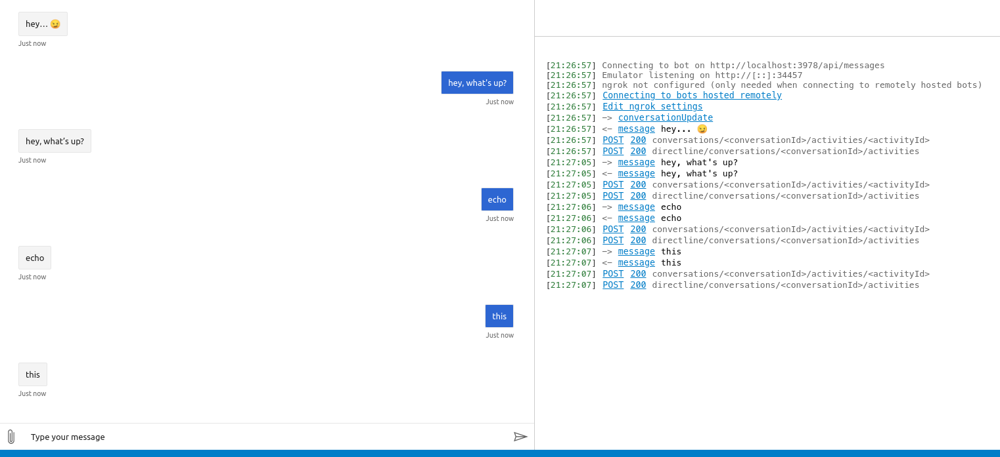

# Echo Bot

Just a bot that echoes whatever you say to it. Useful for testing, or when
you're extraordinarily bored.

This bot has been created using [Bot Framework](https://dev.botframework.com),
it shows how to create a simple bot that accepts input from the user and echoes
it back.

## Prerequisites

- [Node.js](https://nodejs.org) version `10.14.1` or higher
- [Yarn](https://yarnpkg.com/)

## To run the bot

- Install modules

    ```bash
    yarn install
    ```

- Start the bot

    ```bash
    yarn start
    ```

## Testing the Bot Locally

This section outlines the instructions to run and query the bot locally, which
is only intended for development purposes. **Don't follow the same procedure in
a remote server and then claim that the bot's been deployed because it doesn't
count, really 💀**

### Start the Bot

The bot functions as an HTTP API server that listens to port `3978` by default
(you can customise it by setting the `PORT` environment variable).

Refer to [this section](#to-run-the-bot) for information about the command(s) to
run to start the bot.

### Install Bot Framework Emulator

[Bot Framework Emulator](https://github.com/microsoft/botframework-emulator) is
a desktop application that allows bot developers to test and debug their bots on
localhost or running remotely through a tunnel.

Install the Bot Framework Emulator version 4.13.0 or greater from
[here](https://github.com/Microsoft/BotFramework-Emulator/releases)

### Connect to the Bot Using Bot Framework Emulator

- Launch Bot Framework Emulator
- File -> Open Bot
- Enter the Bot URL of `http://localhost:3978/api/messages`

After connecting to the bot you'll a new tab opened in the app which emulates a
messaging app with some other data (e.g. HTTP logs). Send a few messages to the
bot and you'll see those messages sent back to you, like this:


